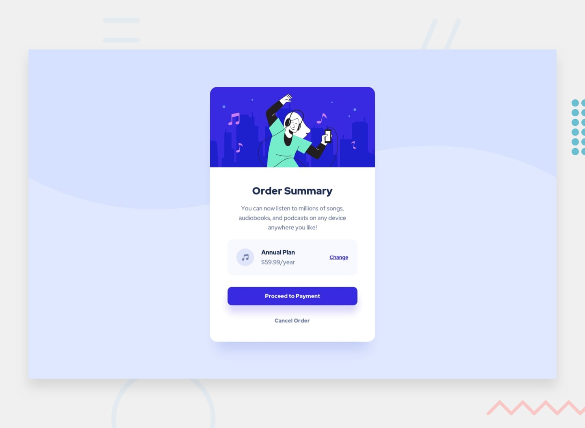
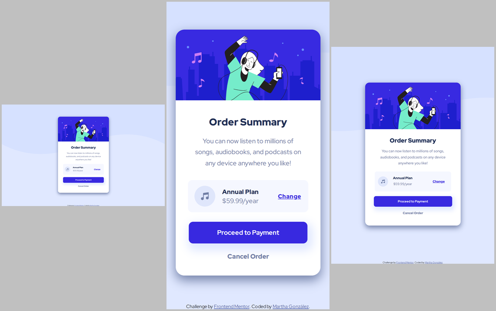

# Frontend Mentor - Order summary card solution

This is a solution to the [Order summary card challenge on Frontend Mentor](https://www.frontendmentor.io/challenges/order-summary-component-QlPmajDUj). Frontend Mentor challenges help you improve your coding skills by building realistic projects. 

## Table of contents

- [Overview](#overview)
  - [The challenge](#the-challenge)
  - [Screenshot](#screenshot)
  - [Links](#links)
- [My process](#my-process)
  - [Built with](#built-with)
  - [What I learned](#what-i-learned)
  - [Continued development](#continued-development)
  - [Useful resources](#useful-resources)  
- [Author](#author)
- [Acknowledgments](#acknowledgments)

**Note: Delete this note and update the table of contents based on what sections you keep.**

## Overview

### The challenge

Users should be able to:

- See hover states for interactive elements

### Screenshot

- Mobile: 375px
- Tablet: 768px
- Desktop: 1440px

### Links

- Solution URL: [Repository](https://github.com/margga88/order-summary-component)
- Live Site URL: [Add live site URL here](https://your-live-site-url.com)

## My process

### Built with

- Semantic HTML5 markup
- CSS custom properties
- Flexbox
- CSS Grid
- Mobile-first workflow

### What I learned

For me this was an opportunity to review all I've learned so far on Frontend Development, as well as testing some new approaches on CSS, and I'm quite satisfied with it. 

### Continued development

I'd like to keep reviewing my skills, especially when it comes to CSS and JS. I know I can do much better.

### Useful resources

- [W3Schools | CSS Media Queries](https://www.w3schools.com/css/css3_mediaqueries.asp) - it was a good guide on how to work with them.

## Author

- Frontend Mentor - [@margga88](https://www.frontendmentor.io/profile/margga88)
- Instagram - [@marticadev](https://www.instagram.com/marticadev)

## Acknowledgments

Once again, I thank to everyone at Frontend Mentor for these challenges, and everyone who helps others to improve their code.
